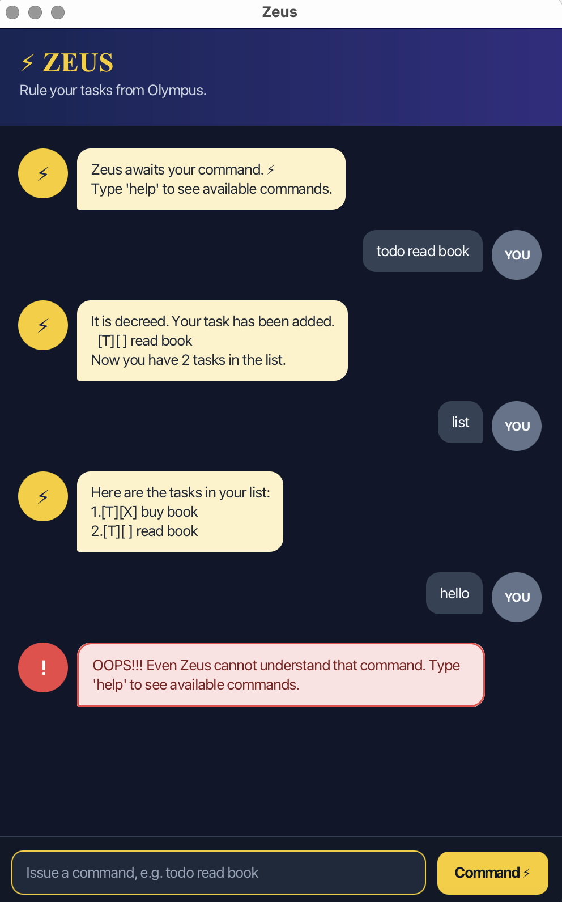

# Zeus User Guide

Zeus is a task-tracking chatbot that helps you manage your tasks quickly through simple commands.

## Getting started

Type a command into the input box and press Enter.

For example:

`todo buy groceries`

To view all available commands, enter:

`help`

## Commands

`todo DESCRIPTION`  
Adds a task without a date.

Example: `todo buy groceries`

`deadline DESCRIPTION /by yyyy-MM-dd`  
Adds a task with a deadline.

Example: `deadline submit report /by 2026-09-20`

`event DESCRIPTION /from yyyy-MM-dd /to yyyy-MM-dd`  
Adds an event with a start and end date.

Example: `event holiday /from 2026-12-01 /to 2026-12-05`

`list`  
Shows all tasks.

`find KEYWORD`  
Finds tasks containing the keyword.

Example: `find report`

`mark NUMBER`  
Marks a task as completed.

Example: `mark 1`

`unmark NUMBER`  
Marks a task as not completed.

Example: `unmark 1`

`delete NUMBER`  
Deletes a task.

Example: `delete 1`

`help`  
Shows the list of available commands.

`bye`  
Exits Zeus.

## Date format

Dates should use the format:

`yyyy-MM-dd`

For example: `2026-09-18`